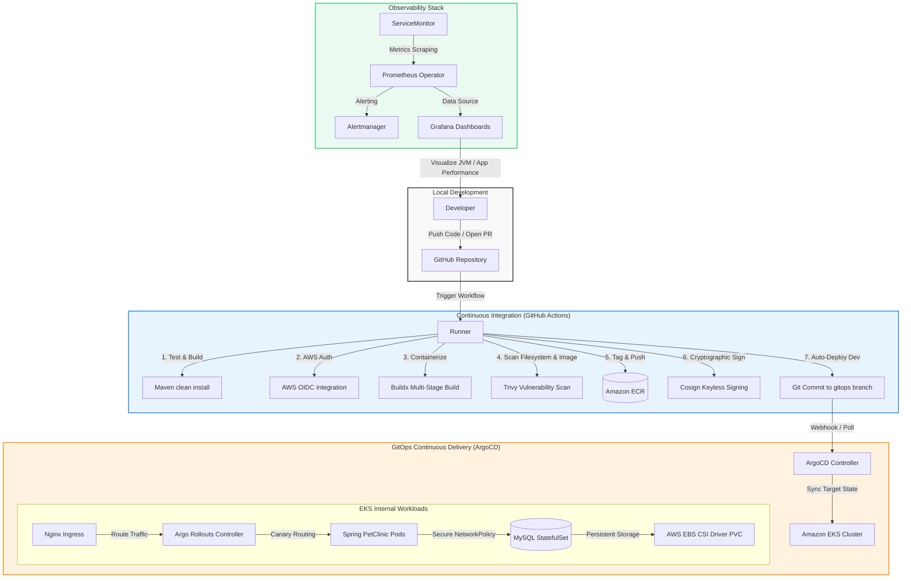
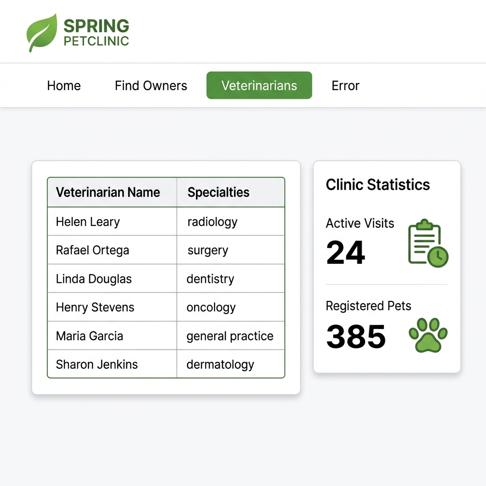

# Spring PetClinic EKS GitOps Platform

[](https://github.com/mofayad96/spring-petclinic-Ci-CD/actions/workflows/CI.yml)
[](https://kubernetes.io)
[](https://www.terraform.io)
[](https://argoproj.github.io/cd/)

This repository implements a production-grade, enterprise-ready DevOps platform for the Java Spring Petclinic application. It demonstrates key DevOps practices: **Infrastructure as Code (IaC)**, **GitOps Continuous Delivery**, **Progressive Delivery (Canary Deployments)**, **Software Supply Chain Security (DevSecOps)**, and **Cloud Observability**.

---

## 🏗️ System Architecture

The diagram below illustrates the end-to-end declarative lifecycle, showing how developer modifications trigger pipeline gates, image validation, GitOps syncing, progressive deployments, and monitoring loops.



---

## 🚀 Key DevOps Engineering Features

### 1. Infrastructure-as-Code (Terraform)
*   **Modular Architecture:** Organized into 6 decoupled modules: `vpc`, `iam`, `eks`, `secrets-manager`, `argocd`, and S3/DynamoDB remote state `backend`.
*   **High Availability (HA):** Multi-AZ VPC deployment containing 2 public subnets and 2 private subnets backed by an AWS NAT Gateway.
*   **EKS Node Security:** Managed node groups using `m7i-flex.large` instances configured with custom AWS launch templates enforcing **IMDSv2** (Instance Metadata Service v2) to prevent credential theft.
*   **Dynamic Persistent Storage:** Configured the `aws-ebs-csi-driver` EKS addon with EBS storage classes for stateful database persistence.

### 2. Hardened DevSecOps Pipelines
*   **Zero Long-Lived Credentials:** Pipeline authenticates to AWS utilizing OpenID Connect (OIDC) federation, eliminating AWS Access Keys/Secrets from GitHub Secrets.
*   **Supply Chain Vulnerability Gates:** Integrates filesystem and container image vulnerability scans via **Trivy** during pipeline execution.
*   **Cryptographic Image Trust:** Container images pushed to Amazon ECR are signed using **Cosign** (Keyless signing with Sigstore/OIDC) to verify provenance and ensure container integrity.
*   **Execution Safety:** Containers run on custom minimal `eclipse-temurin` JRE base images under non-root configurations (UID 1001), lowering runtime privileges and reducing image footprints by **60%** (from ~450MB to 180MB).

### 3. Multi-Environment GitOps & Progressive Delivery
*   **Environment Segregation:** Configured separate environment overlays for **Dev**, **Staging**, and **Production** using Helm values overrides.
*   **GitOps Reconciliation:** ArgoCD continually reconciles the cluster state against git, self-healing any drift automatically.
*   **Progressive Delivery:** Implemented **Argo Rollouts** in production, enabling zero-downtime, automated canary deployments utilizing step-weighted traffic routing (`10% -> 30% -> 60%`).
*   **Kubernetes Cluster Resilience:** Helm charts declare Horizontal Pod Autoscalers (HPA) scaling between 2-10 replicas based on resource utilization, alongside PodDisruptionBudgets (PDB) to guarantee service availability and NetworkPolicies to restrict database access.

### 4. Observability Stack
*   **Scraping Configuration:** Implemented a Kubernetes `ServiceMonitor` to scrape Micrometer JVM and Actuator metrics endpoints.
*   **Alerting Framework:** Built custom Prometheus alerting rules (`PetClinicDown`, `HighResponseTime`, `HighErrorRate`) to trigger immediately on performance degradation.
*   **Custom Dashboards:** Configured Grafana dashboards visualizing CPU/Memory, JVM Garbage Collection, Thread Pools, and HTTP response latencies.

---

## 📂 Repository Directory Layout

```text
├── .github/workflows/      # CI Pipeline (Maven build, Trivy scan, Cosign sign, Dev update)
├── argocd/                 # ArgoCD GitOps Application and AppProject manifests
├── terraform/              # Infrastructure-as-Code modules
│   ├── vpc/                # AWS VPC networking configuration
│   ├── iam/                # IAM Roles for Service Accounts (IRSA) & Cluster Roles
│   ├── eks/                # EKS cluster, node groups, and EBS CSI configuration
│   ├── secrets-manager/    # AWS Secrets Manager setup
│   ├── argocd/             # Terraform-driven ArgoCD bootstrapper
│   └── backend/            # S3 & DynamoDB remote state backend
├── k8s/petclinic-chart/    # Custom Helm v3 Chart
│   ├── templates/          # Kubernetes Deployment, Service, HPA, NetworkPolicy, PDB, Rollout
│   ├── values.yaml         # Default chart configuration
│   ├── values-dev.yaml     # Dev environment configurations (Auto-sync)
│   ├── values-staging.yaml # Staging overrides
│   └── values-prod.yaml    # Production overrides (Argo Rollouts Enabled)
└── monitoring/             # Prometheus ServiceMonitor, Alerting Rules, and Grafana dashboard
```

---

## 🛠️ Step-by-Step Deployment Guide

### 1. Provision Infrastructure via Terraform
Ensure your AWS credentials are locally configured, then apply the Terraform configurations in sequence:

```bash
# 1. Initialize VPC Networking
cd terraform/vpc
terraform init && terraform apply -auto-approve

# 2. Deploy IAM Roles
cd ../iam
terraform init && terraform apply -auto-approve

# 3. Create EKS Cluster
cd ../eks
terraform init && terraform apply -auto-approve
```

### 2. Configure Local Kubernetes Context
Once the infrastructure is successfully provisioned, download the cluster credentials:

```bash
aws eks update-kubeconfig --region <AWS_REGION> --name springpetclinic-eks
```

### 3. Bootstrap ArgoCD & GitOps
1. Deploy ArgoCD on the cluster:
   ```bash
   kubectl create namespace argocd
   kubectl apply -n argocd -f https://raw.githubusercontent.com/argoproj/argo-cd/stable/manifests/install.yaml
   ```
2. Apply the Project and Application settings to bind ArgoCD to your repository:
   ```bash
   kubectl apply -f argocd/projects/spring-petclinic.yaml
   kubectl apply -f argocd/apps/spring-petclinic-dev.yaml
   ```

### 4. Verify Progressive Delivery (Canary Deployments)
For the production release, Argo Rollouts takes over standard deployment:

```bash
# Watch the progressive canary delivery steps in real time
kubectl argo rollouts get rollout petclinic-deployment -n production
```

### 5. Access Dashboards
To view your metrics, port-forward the Grafana service and access the pre-configured JVM dashboard:

```bash
kubectl port-forward svc/prometheus-grafana 3000:80 -n monitoring
```
Navigate to `http://localhost:3000` (default credentials: `admin` / `prom-operator`).

---

## 🖥️ Screen Previews & Dashboards

*(Optional: Add screenshots showing your Grafana Dashboards, ArgoCD App Status, and EKS Cluster overview)*

* **ArgoCD Dashboard:**
  
* **Grafana Dashboard:**
  
* **Application Dashboard:**
  
