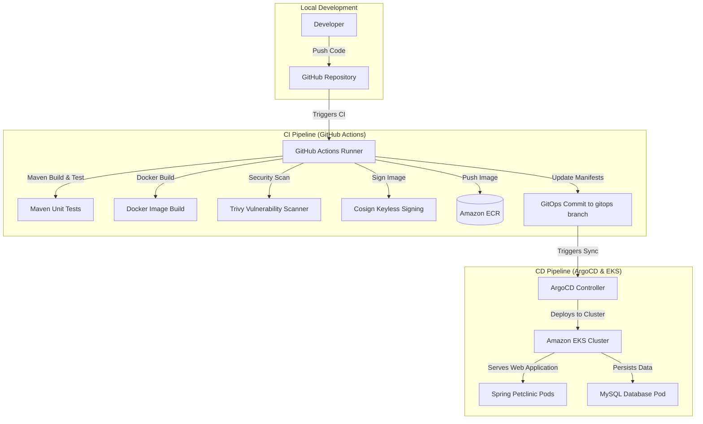

# Spring Petclinic CI/CD GitOps Portfolio Project

This repository contains the complete enterprise CI/CD and GitOps infrastructure for the Spring Petclinic application. It demonstrates modern DevOps engineering principles including Infrastructure as Code (IaC), containerization, automated testing, container image signing, security vulnerability scanning, and automated GitOps continuous deployment.

---

## 🏗️ Architecture Diagram

The diagram below illustrates the end-to-end CI/CD and GitOps workflow, spanning local development, security-hardened building, and deployment into AWS via Terraform, Helm, and ArgoCD.



---

## 🛠️ Tech Stack

*   **Application Framework:** Java 17, Spring Boot, Spring MVC
*   **Database:** MySQL
*   **Infrastructure as Code (IaC):** Terraform (AWS provider)
*   **Containerization & Orchestration:** Docker, Kubernetes (Amazon EKS)
*   **Deployment & Packaging:** Helm (v3), ArgoCD (GitOps)
*   **Continuous Integration:** GitHub Actions
*   **Security & Compliance:** Trivy (Vulnerability scanning), Cosign (OIDC/Keyless image signing)

---

## 🖥️ Application Screenshot

Below is a preview of the Spring Petclinic running application:


---

## 🚀 How to Deploy

### 1. Provision Infrastructure via Terraform
First, navigate to the terraform directory to set up your network structure and EKS cluster:

```bash
# Initialize Terraform
cd terraform/vpc
terraform init
terraform apply -auto-approve

# Deploy IAM roles and EKS cluster
cd ../iam
terraform init && terraform apply -auto-approve

cd ../eks
terraform init && terraform apply -auto-approve
```

### 2. Configure Local Kubernetes Context
Connect to the newly created EKS cluster using your AWS CLI credentials:

```bash
aws eks update-kubeconfig --region <AWS_REGION> --name springpetclinic-eks
```

### 3. Deploy the Application using Helm
You can manually deploy the application templates to verify the cluster state:

```bash
# Lint the Helm chart
helm lint k8s/petclinic-chart

# Perform a dry-run install
helm install springpetclinic k8s/petclinic-chart --dry-run --debug

# Install/Upgrade the chart
helm upgrade --install springpetclinic k8s/petclinic-chart --values k8s/petclinic-chart/values.yaml
```

### 4. Continuous Delivery with ArgoCD
To configure GitOps continuous delivery:

1.  Deploy ArgoCD onto your cluster:
    ```bash
    kubectl create namespace argocd
    kubectl apply -n argocd -f https://raw.githubusercontent.com/argoproj/argo-cd/stable/manifests/install.yaml
    ```
2.  Apply the ArgoCD Application definition matching your repository branch config:
    ```bash
    kubectl apply -f argocd/application.yaml
    ```
